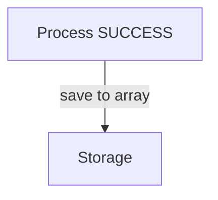

# AI Agent Instructions

This file contains guidance for AI coding agents working on this project.

---

## Mermaid Diagrams

### Preferences

1. **Prefer sequence diagrams** for showing interactions and flows
2. **Show happy path only by default** - omit error handling unless specifically requested
3. **Alternative diagram types:**
   - Sequence Diagram: interactions over time (PREFERRED)
   - Flowchart/Graph: structure and relationships
   - State Diagram: state transitions
   - Class Diagram: classes and relationships
   - Entity Relationship: database schema

### Technical Rules

When creating or editing Mermaid diagrams in this project, follow these rules to avoid parsing errors:

### ❌ Do Not Use

1. **No emojis or Unicode symbols in labels**
   - Bad: `Node[✅ Success]` or `Node[❌ Error]`
   - Good: `Node[Success]` or `Node[ERROR: Problem]`

2. **No square brackets in edge or node labels**
   - Bad: `A -->|stores in array[]| B` or `Node[videos[] list]`
   - Good: `A -->|stores in array| B` or `Node[videos list]`

3. **Avoid special characters with syntactic meaning**
   - Brackets: `[]`, `{}`
   - Quotes in labels can break: use single quotes sparingly
   - Symbols: `+`, `*` (in some contexts)

### ✅ Best Practices

1. **Keep labels simple**
   - Use alphanumeric characters
   - Use basic punctuation: `-`, `,`, `.`, `:`, `;`
   - Use HTML breaks for multi-line: `<br/>`

2. **For emphasis, use text conventions**
   - Instead of ❌: use "ERROR:", "PROBLEM:", "BAD:"
   - Instead of ✅: use "GOOD:", "OK:", "SUCCESS:"
   - Use ALL CAPS for emphasis

3. **Test diagrams**
   - Verify in PyCharm Mermaid plugin before committing
   - Or paste into https://mermaid.live for validation

### Example

**Bad:**
```mermaid
graph TB
    A[Process ✅]
    B[Storage 📦]
    A -->|save to array[]| B
```

**Good:**


---

## Explaining Solutions

### Do NOT Show Code Immediately

When proposing solutions to problems:

1. ✅ **Explain the approach conceptually**
   - Describe the architectural change
   - Explain what needs to be modified and why
   - Outline the flow of data/control
   - Keep it concise (2-3 paragraphs maximum)

2. ✅ **Allow the user to think**
   - The user wants to exercise their analytical and design skills
   - Showing code immediately deprives them of this important exercise
   - This mirrors real-world collaboration

3. ✅ **Offer to show code**
   - After the conceptual explanation, offer: "Would you like to see the code for this?"
   - Wait for the user to request it

4. ❌ **Do NOT include code blocks in the initial response**
   - No code examples
   - No implementation details
   - Keep it high-level and architectural

### Exception

Show code immediately only when:
- User explicitly asks: "Show me the code"
- User says: "Write the code" or "Implement that"
- The question is specifically about syntax or a code snippet

### Example

**Bad Response:**
> "Here's how to fix the tool result handling. Update tool_executor.py:
> ```python
> def execute_tool(self, tool_name, tool_input, tool_use_id):
>     # ... 50 lines of code ...
> ```"

**Good Response:**
> "The tool result format should be created in ToolExecutor, not chat_agent. The executor would take the tool_use_id as a parameter, execute the tool, then wrap the result in Anthropic's format before returning it. This keeps API-specific formatting in the tool layer where it belongs. Would you like to see the code changes for this?"

---

## Code Changes Workflow

**The user (project owner) implements all code changes.**

AI agents should:
1. ✅ Analyze and understand the codebase
2. ✅ Propose solutions conceptually (architecture, not code)
3. ✅ Offer to show code examples when helpful
4. ✅ Answer questions about the code
5. ✅ Create diagrams to visualize systems

AI agents should NOT:
1. ❌ Write code directly to files without explicit permission
2. ❌ Show code in the initial response (explain conceptually first)
3. ❌ Assume they should implement proposed solutions

### Proper Workflow

```
1. User asks for help
2. AI analyzes the problem
3. AI proposes solution CONCEPTUALLY
4. AI offers to show code if helpful
5. User thinks through the solution
6. User asks for code if needed
7. User implements (or grants permission to AI)
```

---

## Future Sections

Additional AI agent guidance will be added here as the project evolves.
