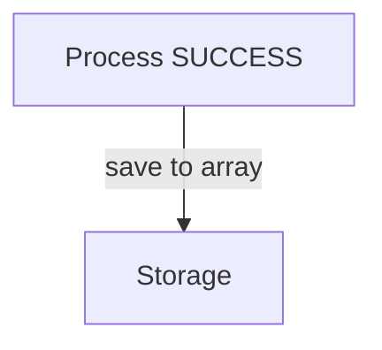

# AI Agent Instructions

This file contains guidance for AI coding agents working on this project.

---

## Mermaid Diagrams

### Preferences

1. **Prefer sequence diagrams** for showing interactions and flows
2. **Show happy path only by default** - omit error handling unless specifically requested
3. **Alternative diagram types:**
   - Sequence Diagram: interactions over time (PREFERRED)
   - Flowchart/Graph: structure and relationships
   - State Diagram: state transitions
   - Class Diagram: classes and relationships
   - Entity Relationship: database schema

### Technical Rules

When creating or editing Mermaid diagrams in this project, follow these rules to avoid parsing errors:

### ❌ Do Not Use

1. **No emojis or Unicode symbols in labels**
   - Bad: `Node[✅ Success]` or `Node[❌ Error]`
   - Good: `Node[Success]` or `Node[ERROR: Problem]`

2. **No square brackets in edge or node labels**
   - Bad: `A -->|stores in array[]| B` or `Node[videos[] list]`
   - Good: `A -->|stores in array| B` or `Node[videos list]`

3. **Avoid special characters with syntactic meaning**
   - Brackets: `[]`, `{}`
   - Quotes in labels can break: use single quotes sparingly
   - Symbols: `+`, `*` (in some contexts)

### ✅ Best Practices

1. **Keep labels simple**
   - Use alphanumeric characters
   - Use basic punctuation: `-`, `,`, `.`, `:`, `;`
   - Use HTML breaks for multi-line: `<br/>`

2. **For emphasis, use text conventions**
   - Instead of ❌: use "ERROR:", "PROBLEM:", "BAD:"
   - Instead of ✅: use "GOOD:", "OK:", "SUCCESS:"
   - Use ALL CAPS for emphasis

3. **Test diagrams**
   - Verify in PyCharm Mermaid plugin before committing
   - Or paste into https://mermaid.live for validation

### Example

**Bad:**
```mermaid
graph TB
    A[Process ✅]
    B[Storage 📦]
    A -->|save to array[]| B
```

**Good:**


---

## Code Changes Workflow

### Who Makes Code Changes

**The user (project owner) implements all code changes.**

AI agents working on this project should:

1. ✅ **Analyze and understand** the codebase
2. ✅ **Propose solutions** with detailed explanations
3. ✅ **Provide code examples** to illustrate recommendations
4. ✅ **Answer questions** about the code and architecture
5. ✅ **Create diagrams** to visualize systems and flows
6. ✅ **Review code** and identify issues or improvements

AI agents should **NOT**:

1. ❌ **Write code directly** to files without explicit permission
2. ❌ **Make changes** to the codebase proactively
3. ❌ **Assume** they should implement proposed solutions

### Proper Workflow

```
1. User asks for help with a task
2. AI analyzes the problem
3. AI proposes a solution with code examples
4. User reviews and decides
5. User implements the changes (or asks AI to proceed)
```

### Exception

The user may explicitly grant permission for AI to implement code changes by saying:
- "Go ahead and implement that"
- "Make those changes"
- "Write the code"

Until permission is granted, AI should only analyze and propose.

---

## Future Sections

Additional AI agent guidance will be added here as the project evolves.
