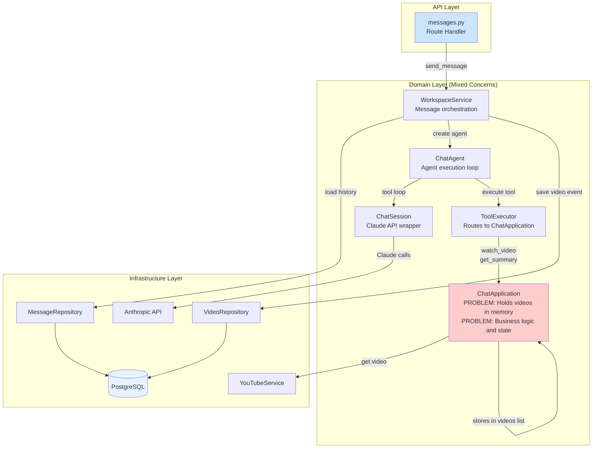
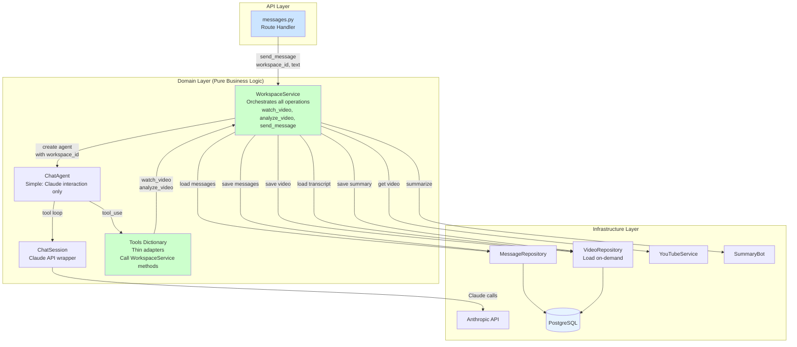

# Architecture Comparison

## Current Architecture (As-Is)

**Problems:**
- ChatApplication holds videos list in memory (stateful)
- Must pre-load ALL transcripts before agent starts
- Tools mutate in-memory state (videos.append)
- ChatApplication has mixed responsibilities (state management and business logic)
- Video context lost after agent finishes
- Doesn't scale to workspaces with many videos

---

## Ideal DDD Architecture (To-Be)

**Benefits:**
- WorkspaceService is single orchestrator (all business logic)
- Load transcripts on-demand (only when needed)
- No in-memory state (everything persisted immediately)
- Tools are thin adapters (just call WorkspaceService)
- ChatAgent simplified (just Claude interaction)
- Scales to any workspace size
- Clear separation of concerns

---

## Key Differences

| Aspect | Current (As-Is) | Ideal (To-Be) |
|--------|----------------|---------------|
| **State** | ChatApplication holds videos[] | Stateless - load from DB on-demand |
| **Transcript loading** | Pre-load ALL videos upfront | Load only when needed |
| **Business logic** | Split across ChatApplication + WorkspaceService | Centralized in WorkspaceService |
| **Tools** | Execute via ToolExecutor → ChatApplication | Call WorkspaceService directly |
| **Video context** | Lost after agent finishes | Persisted in DB, always available |
| **Scalability** | Limited (must load all transcripts) | Unlimited (on-demand loading) |
| **Complexity** | 4 layers (Route→WS→TE→ChatApp) | 3 layers (Route→WS→Repos) |

---

## Migration Path

**Phase 1: Move business logic to WorkspaceService**
1. Add `watch_video(workspace_id, url)` to WorkspaceService
2. Add `analyze_video(workspace_id, video_id)` to WorkspaceService
3. Tools call WorkspaceService instead of ChatApplication

**Phase 2: Remove ChatApplication state**
1. ChatApplication no longer holds videos[]
2. Remove in-memory list management
3. VideoRepository.save_video() returns video_id

**Phase 3: Simplify ChatAgent**
1. ChatAgent just handles Claude interaction
2. ToolExecutor calls WorkspaceService directly
3. Remove ChatApplication entirely (logic moved to WorkspaceService)

**Result:** Clean DDD architecture with clear separation of concerns
