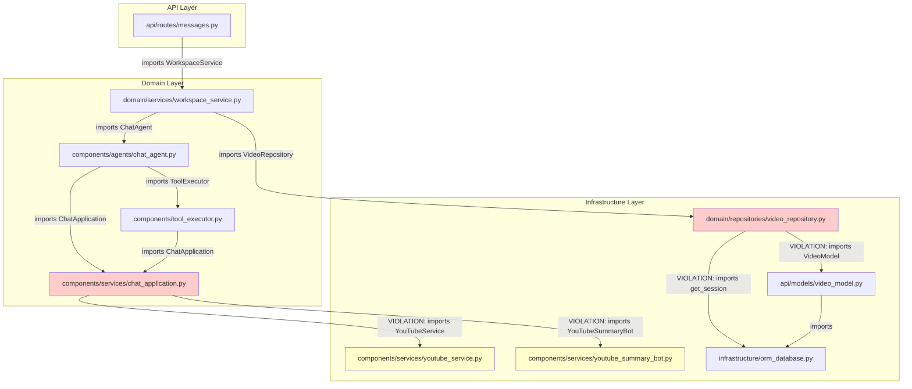
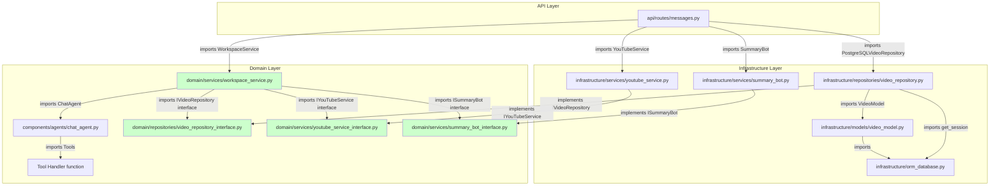
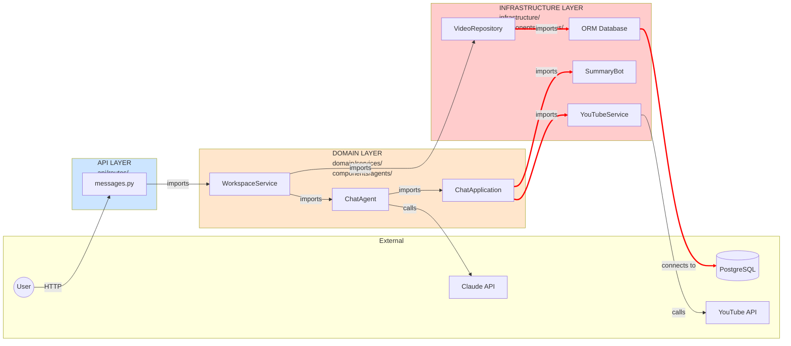
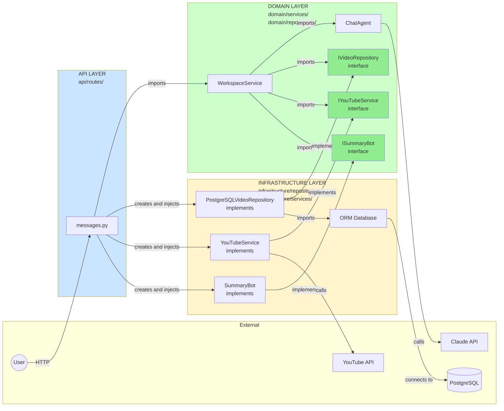

# Dependency Analysis - Import Structure

This document shows **compile-time dependencies** (what imports what), not runtime behavior.

---

## 1. Component/Dependency Diagram

### Current Architecture - Import Dependencies



**Violations (red boxes):**
- `chat_appllcation.py` imports `youtube_service.py` (Domain → Infrastructure)
- `chat_appllcation.py` imports `youtube_summary_bot.py` (Domain → Infrastructure)
- `video_repository.py` imports `video_model.py` (Domain → Infrastructure - wrong layer)
- `video_repository.py` imports `orm_database.py` (Domain → Infrastructure)

**These are COMPILE-TIME dependencies - the imports in the code.**

---

### DDD Architecture - Import Dependencies (Corrected)



**All dependencies point INWARD toward Domain (green boxes = interfaces):**
- Domain only imports Domain interfaces
- Infrastructure imports and implements Domain interfaces
- API wires everything together (can import from both layers)

**No violations - all arrows either stay within layer or point toward Domain.**

---

## 3. Layer Diagram with Import Arrows

### Current Architecture - Layer Dependencies



**Red arrows = VIOLATIONS (Domain importing from Infrastructure)**

---

### DDD Architecture - Layer Dependencies (Corrected)



**Green = Correct dependencies (all pointing toward Domain interfaces)**

**Key difference:**
- **Current:** Domain imports Infrastructure (red arrows going right)
- **DDD:** Infrastructure imports Domain interfaces (arrows going left toward center)

---

## Code Examples - Side by Side

### Current Architecture (WRONG)

```python
# components/services/chat_appllcation.py (DOMAIN LAYER)
from components.services.youtube_summary_bot import YouTubeSummaryBot  # ← VIOLATION
from components.services.youtube_service import YouTubeService  # ← VIOLATION

class ChatApplication:
    def __init__(self, videos: list[YouTubeVideo] = [], on_event: Callable=None):
        self.youtube: YouTubeService = YouTubeService()  # ← Creates Infrastructure
        self.summary_bot = YouTubeSummaryBot()  # ← Creates Infrastructure
        self.videos = videos
        self.on_event = on_event
```

**Problem:** Domain layer imports and creates Infrastructure classes directly.

---

### DDD Architecture (CORRECT)

```python
# domain/services/workspace_service.py (DOMAIN LAYER)
from domain.repositories.video_repository_interface import IVideoRepository  # ← Domain interface
from domain.services.youtube_service_interface import IYouTubeService  # ← Domain interface
from domain.services.summary_bot_interface import ISummaryBot  # ← Domain interface

class WorkspaceService:
    def __init__(
        self,
        video_repo: IVideoRepository,  # ← Injected interface
        youtube_service: IYouTubeService,  # ← Injected interface
        summary_bot: ISummaryBot  # ← Injected interface
    ):
        self.video_repo = video_repo
        self.youtube = youtube_service
        self.summary_bot = summary_bot

    def watch_video(self, workspace_id, url):
        video = self.youtube.get_video(url)  # Uses interface, doesn't know concrete class
        video_id = self.video_repo.save(workspace_id, video.to_dict())
        return video_id
```

```python
# infrastructure/services/youtube_service.py (INFRASTRUCTURE LAYER)
from domain.services.youtube_service_interface import IYouTubeService  # ← Imports from Domain

class YouTubeService(IYouTubeService):  # ← Implements Domain interface
    def get_video(self, url):
        # YouTube API specific implementation
        pass
```

```python
# api/routes/messages.py (API LAYER - wires everything together)
from domain.services.workspace_service import WorkspaceService
from infrastructure.repositories.video_repository import PostgreSQLVideoRepository
from infrastructure.services.youtube_service import YouTubeService
from infrastructure.services.summary_bot import SummaryBot

@router.post("/messages")
def send_message(workspace_id: str, message: str):
    # API layer creates concrete implementations
    video_repo = PostgreSQLVideoRepository(get_session())
    youtube_service = YouTubeService()
    summary_bot = SummaryBot()

    # API layer injects them into domain service
    workspace_service = WorkspaceService(
        video_repo=video_repo,
        youtube_service=youtube_service,
        summary_bot=summary_bot
    )

    result = workspace_service.send_message(workspace_id, message)
    return result
```

**Solution:**
- Domain only imports interfaces (from Domain layer)
- Infrastructure implements interfaces (imports FROM Domain)
- API wires concrete implementations into domain services (dependency injection)

---

## Summary

**The diagrams show:**

1. **Component/Dependency Diagram:** Shows which files import which (compile-time structure)
2. **Layer Diagram:** Shows dependency direction between layers

**Current Architecture violations:**
- Red arrows going FROM Domain TO Infrastructure
- Domain creates Infrastructure objects with `new`
- Domain imports from Infrastructure layer

**DDD Architecture (correct):**
- Green arrows going FROM Infrastructure TO Domain
- Domain only knows about interfaces
- Infrastructure implements Domain interfaces
- API does all the wiring (dependency injection)

**This is the difference that sequence diagrams don't show - the import/dependency structure, not the runtime behavior.**
