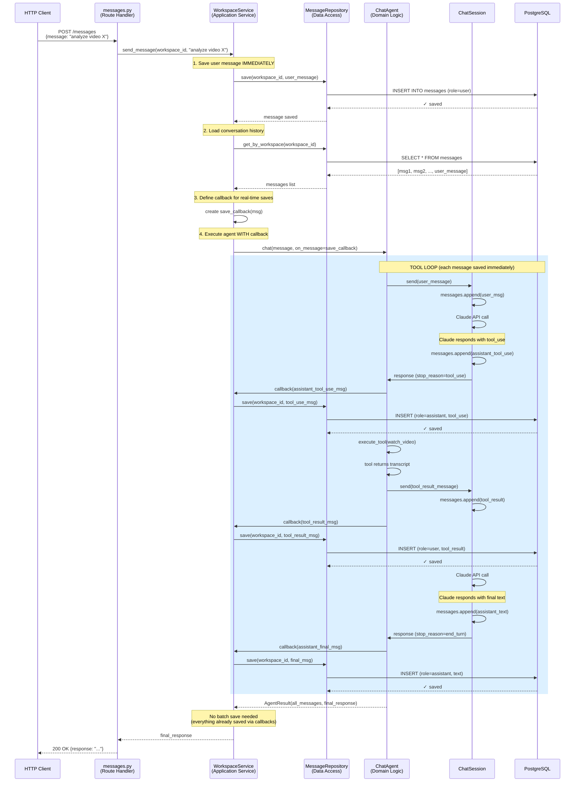

# Message Flow with Callbacks (Real-time Save)

## Callback Approach - Messages Saved During Execution



## Key Differences from Batch Approach

### Messages Saved During Execution (Real-time)

1. **User message** → Saved BEFORE agent starts
2. **Tool use message** → Saved IMMEDIATELY when created (during tool loop)
3. **Tool result message** → Saved IMMEDIATELY when created (during tool loop)
4. **Final assistant message** → Saved IMMEDIATELY when created (during tool loop)

### Benefits

✅ **Database always current** - Can query DB mid-execution to see progress
✅ **Never lose tool messages** - Saved as they happen, not batched
✅ **Streaming-ready** - Callback is same mechanism needed for streaming
✅ **Better debugging** - See exact state even if agent crashes mid-loop

### Implementation Changes Required

**ChatAgent needs callback parameter:**
```python
def chat(self, message: str, on_message: callable = None) -> AgentResult:
    # ... existing code ...

    while True:
        if response.stop_reason != 'tool_use':
            # Final message
            if on_message:
                on_message(final_message)
            break
        else:
            # Tool use message
            tool_use_msg = {...}
            if on_message:
                on_message(tool_use_msg)

            # Execute tool
            tool_result_msg = {...}
            if on_message:
                on_message(tool_result_msg)
```

**WorkspaceService creates callback:**
```python
def send_message(self, workspace_id: int, message_text: str) -> str:
    # Save user message
    self.message_repo.save(workspace_id, user_message)

    # Load history
    messages = self.message_repo.get_by_workspace(workspace_id)

    # Define callback
    def save_callback(message):
        self.message_repo.save(workspace_id, message)

    # Execute with callback
    agent = ChatAgent(videos=[], messages=messages)
    result = agent.chat(message_text, on_message=save_callback)

    return result.final_response
```

## Future: Streaming Extension

When adding streaming, just extend the callback:

```python
def send_message_stream(self, workspace_id, message_text):
    # Same setup...

    def stream_and_save_callback(message):
        self.message_repo.save(workspace_id, message)  # Save (already doing this)
        yield format_sse(message)  # AND stream to client (new)

    for event in agent.chat_stream(message_text, on_message=stream_and_save_callback):
        yield event
```

**The callback mechanism is the foundation for streaming.**

