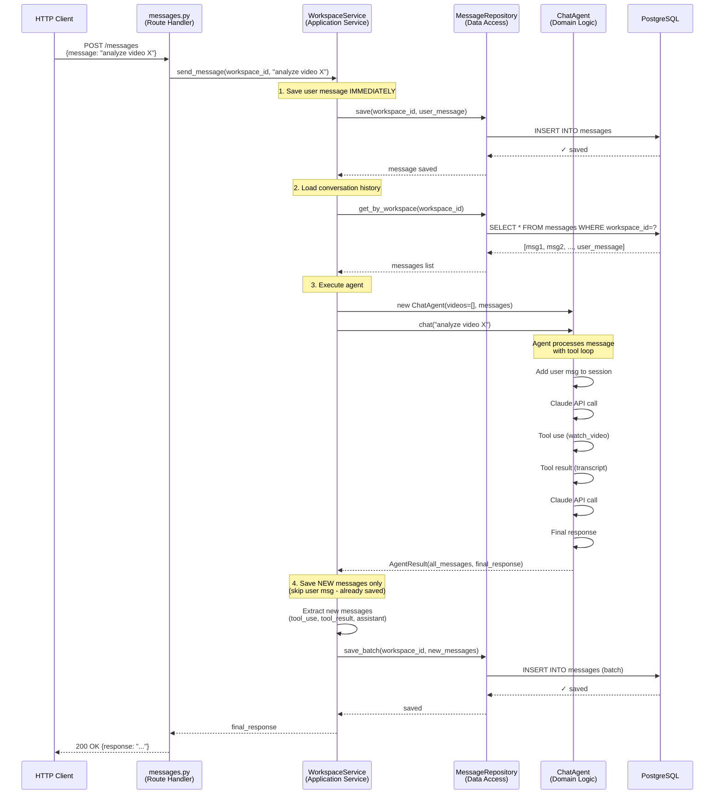

# Message Flow Sequence Diagram

## Incremental Save Approach (Recommended)



## Key Points

1. **User message saved immediately** (line 13-16)
   - Never lost even if agent crashes
   - User sees "received" confirmation instantly

2. **Load includes the message we just saved** (line 19-23)
   - Agent gets full conversation context
   - Includes the user message we just persisted

3. **Agent executes with full context** (line 26-37)
   - Tool loop happens in memory
   - No DB writes during execution

4. **Save only NEW messages** (line 41-47)
   - Skip user message (already saved in step 1)
   - Batch save tool_use, tool_result, assistant messages
   - Atomic - either all save or none

## Failure Scenarios

### Scenario A: Agent crashes mid-execution
```
✅ User message: SAVED (step 1)
❌ Tool messages: LOST
❌ Assistant response: LOST

User can see their message in history and retry.
```

### Scenario B: Database fails during final save
```
✅ User message: SAVED (step 1)
❌ Tool messages: LOST (transaction rollback)
❌ Assistant response: NOT RETURNED to user

User sees error, can retry. Their message is preserved.
```

## Comparison to Batch Approach

### Batch (save everything at end):
- ❌ User message lost if agent crashes
- ✅ All-or-nothing atomicity
- ❌ No visibility during execution

### Incremental (save user message first):
- ✅ User message always saved
- ⚠️ Partial state if agent crashes (user msg exists, no response)
- ✅ Can see user input immediately
- ✅ Better UX - user sees "received" confirmation

