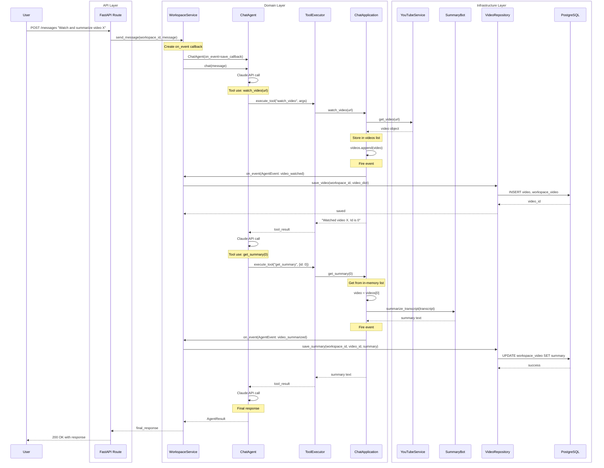
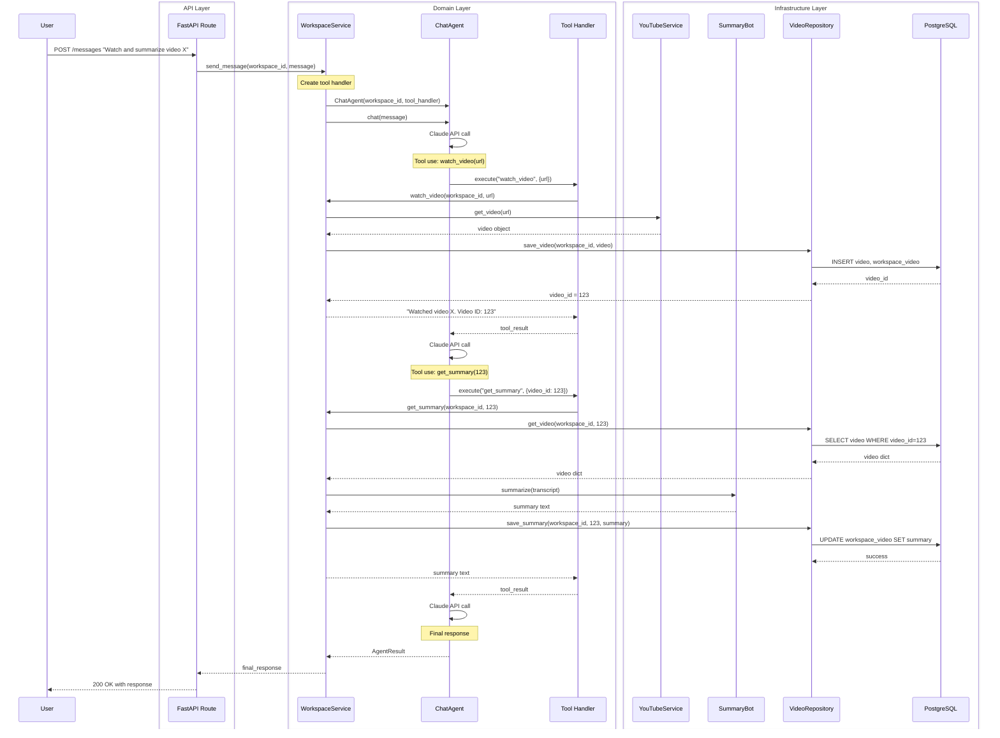
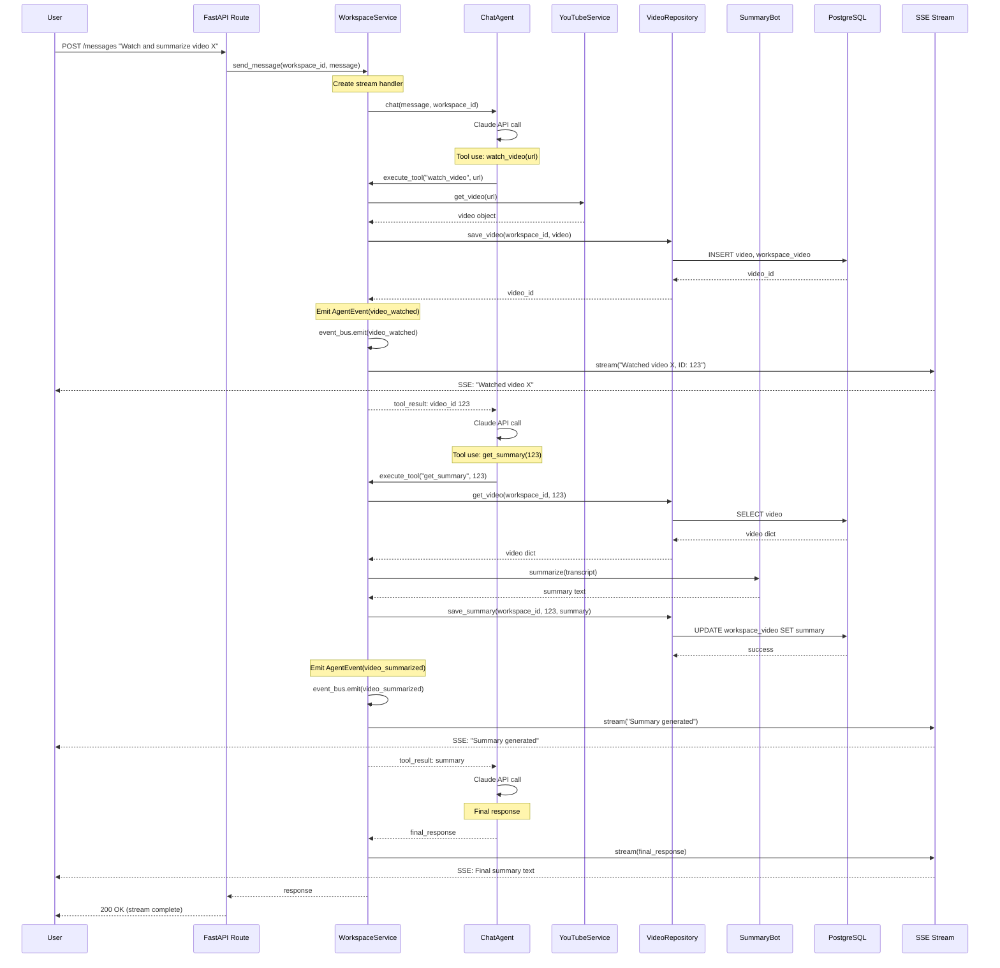
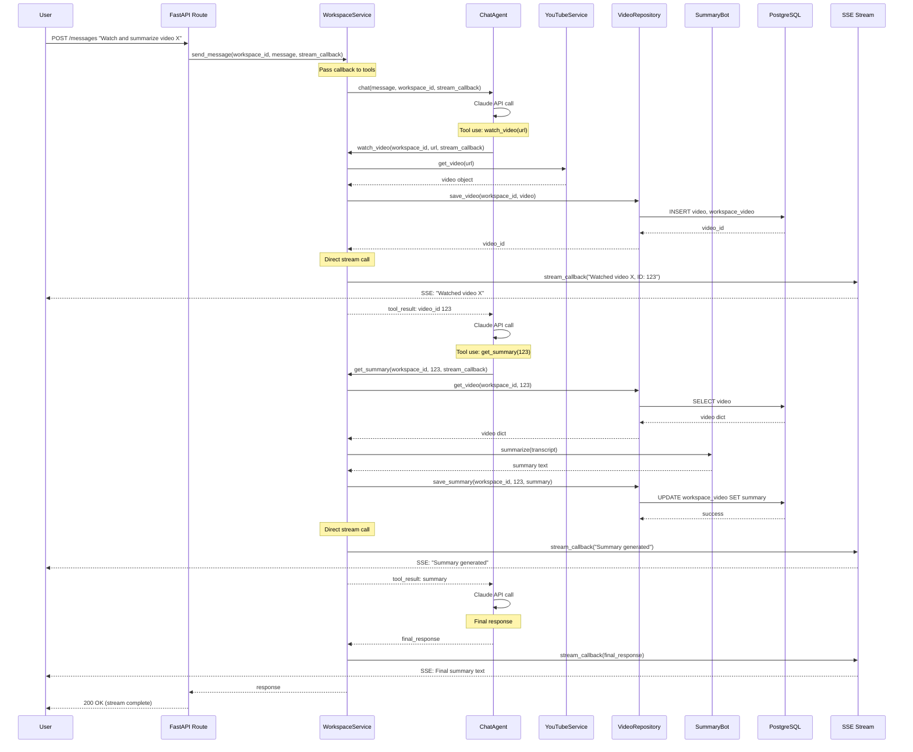

# Architecture Comparison - Watch and Summarize Flow

## How to Read These Diagrams

**Participants are grouped by architectural layer:**
- **API Layer (left box):** HTTP interface (FastAPI routes)
- **Domain Layer (middle box):** Business logic (services, agents)
- **Infrastructure Layer (right box):** Technical implementations (databases, external APIs)

**Dependency rules for Clean Architecture:**
- ✓ **API → Domain:** API can call Domain (correct)
- ✓ **Infrastructure → Domain:** Infrastructure implements Domain interfaces (correct - dependency inversion)
- ❌ **Domain → Infrastructure:** Domain should NOT import/create Infrastructure classes (violation)
- ✓ **Domain → Domain:** Domain can call other Domain components (correct)

**Look for arrows crossing boundaries the wrong way.**

---

## Current Architecture (As-Is with Events)



**Problems:**
- ChatApplication holds videos in memory (array index 0)
- Must pre-load all videos before agent starts
- Video ID from database not used by tools
- Events fired for side effects, handled by callback
- State lost after agent finishes

**Boundary Violations (Wrong Dependencies):**
- ❌ ChatApp → YT (Domain imports and creates Infrastructure directly)
- ❌ ChatApp → SB (Domain imports and creates Infrastructure directly)
- ❌ Line 30 in chat_appllcation.py: `self.youtube = YouTubeService()` (Domain creates Infrastructure)
- ❌ Line 14 in chat_appllcation.py: `self.summary_bot = YouTubeSummaryBot()` (Domain creates Infrastructure)
- ✓ API → Domain (correct direction)
- ✓ Domain → Infrastructure via callback (acceptable pattern, though not pure dependency inversion)

---

## DDD Architecture (To-Be without Events)



**Benefits:**
- No in-memory state - load from DB on-demand
- Tools use database video_id (stable across sessions)
- WorkspaceService orchestrates all business logic
- Direct saves (no events needed for simple save operations)
- Scales to any workspace size

**Boundary Analysis (Correct Dependencies):**
- ✓ API → Domain (correct: API depends on Domain)
- ✓ Infrastructure → Domain (correct: VR would implement IVideoRepository from Domain)
- ✓ Domain calls Infrastructure through injected dependencies (WS receives YT, SB, VR via constructor)
- ✓ No Domain → Infrastructure imports (Domain only knows about interfaces)
- ✓ Tools are just functions that delegate to WorkspaceService (thin adapters)
- ✓ All dependencies point inward toward Domain

---

## Streaming Architecture - Event vs Callback Comparison

## Option A: Service Methods Emit Events



**Characteristics:**
- **Event bus pattern** - services emit domain events
- **Decoupled** - service doesn't know about streaming
- **Observers subscribe** - stream handler listens to events
- **More complex** - needs event bus infrastructure
- **Flexible** - multiple listeners can react to same event

---

## Option B: Service Methods Get Stream Callback



**Characteristics:**
- **Direct callback pattern** - service calls stream function directly
- **Coupled** - service knows about streaming (passed as parameter)
- **Simple** - no event bus needed
- **Explicit** - clear where streaming happens
- **Single listener** - callback is 1:1 with stream

---

## Key Differences

| Aspect | Option A (Events) | Option B (Callback) |
|--------|-------------------|---------------------|
| **Coupling** | Decoupled - service emits, doesn't know who listens | Coupled - service calls callback directly |
| **Infrastructure** | Needs event bus system | Just function parameter |
| **Flexibility** | Multiple listeners possible | Single callback per invocation |
| **Complexity** | Higher - event system to manage | Lower - simple function call |
| **Traceability** | Events can be logged/traced centrally | Callback flow is explicit in code |
| **Testing** | Can test service without stream concerns | Must mock callback in tests |

---

## Recommendation

**For MVP: Option B (Callback)**

**Reasons:**
1. Simpler implementation - no event bus needed
2. Explicit control flow - easy to follow
3. Sufficient for single SSE stream use case
4. Can refactor to event bus later if needed

**When to use Option A:**
- Need multiple listeners (e.g., logging + streaming + metrics)
- Want domain services completely decoupled from infrastructure
- Building event-sourced system
- Need event replay/audit trail

**Implementation Example (Option B):**

```python
# WorkspaceService
def send_message(self, workspace_id, message_text, stream_callback=None):
    def tool_handler(tool_name, args):
        if tool_name == "watch_video":
            return self.watch_video(workspace_id, args['url'], stream_callback)
        elif tool_name == "get_summary":
            return self.get_summary(workspace_id, args['video_id'], stream_callback)

    agent = ChatAgent(workspace_id, tool_handler)
    result = agent.chat(message_text)

    if stream_callback:
        stream_callback(result.final_response)

    return result

def watch_video(self, workspace_id, url, stream_callback=None):
    video = self.youtube_service.get_video(url)
    video_id = self.video_repo.save_video(workspace_id, video.to_dict())

    if stream_callback:
        stream_callback(f"Watched {video.title}. Video ID: {video_id}")

    return video_id

def get_summary(self, workspace_id, video_id, stream_callback=None):
    video = self.video_repo.get_video(workspace_id, video_id)
    summary = self.summary_bot.summarize(video['transcript'])
    self.video_repo.save_summary(workspace_id, video_id, summary)

    if stream_callback:
        stream_callback(f"Summary generated for video {video_id}")

    return summary
```

**Route Handler (FastAPI with SSE):**

```python
@router.post("/messages/stream")
async def send_message_stream(workspace_id: str, message: str):
    async def event_generator():
        def stream_callback(text):
            # Called by WorkspaceService
            yield f"data: {json.dumps({'text': text})}\n\n"

        workspace_service.send_message(workspace_id, message, stream_callback)

    return StreamingResponse(event_generator(), media_type="text/event-stream")
```
